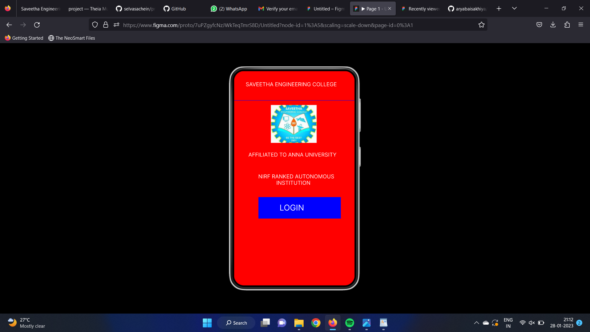
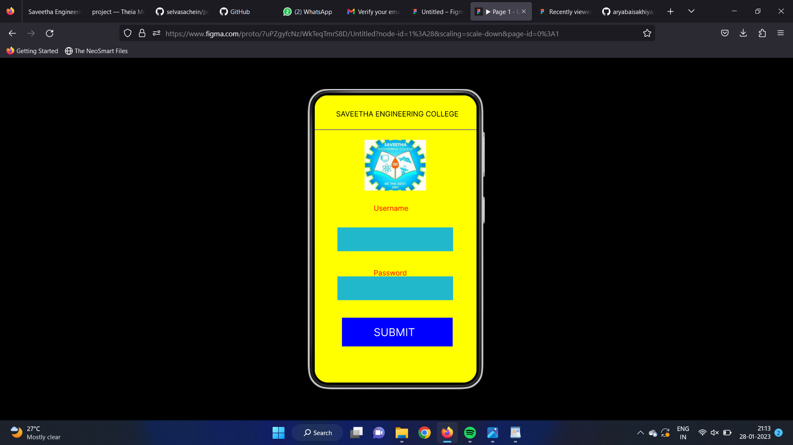
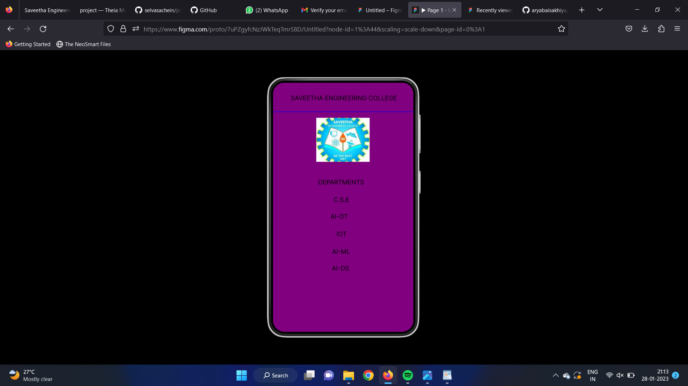

# Event Registration Web Application

## AIM:
To design, develop and deploy a web application for event registration.

## DESIGN STEPS:

### Step 1:
Create a new frame.

### Step 2:
Select any one preset size of your choice.

### Step 3:
Select the shapes you need.

### Step 4:
Import images as needed.

### Step 5:
Create pages based on your need and link them.

### Step 6:

Validate the HTML and CSS code.

### Step 6:

Publish the website in the given URL.

## DESIGN TOOL:
Figma
## code:
/* Home Page */

position: relative;
width: 360px;
height: 640px;

background: #FF0000;

/* Login Page */

position: relative;
width: 360px;
height: 640px;

background: #FFFF00;

/* SAVEETHA ENGINEERING COLLEGE */

position: absolute;
width: 291px;
height: 45px;
left: 46px;
top: 30px;

font-family: 'Inter';
font-style: normal;
font-weight: 400;
font-size: 16px;
line-height: 19px;

color: #000000;

/* Line 2 */
position: absolute;
width: 360px;
height: 0px;
left: 0px;
top: 75px;
border: 1px solid #0000FF;
/* SAVEETHALOGO 3 */
position: absolute;
width: 137px;
height: 113px;
left: 111px;
top: 90px;
background: url(SAVEETHALOGO.jpg);
/* DEPARTMENTS */
position: absolute;
width: 291px;
height: 45px;
left: 17px;
top: 246px;
font-family: 'Inter';
font-style: normal;
font-weight: 400;
font-size: 16px;
line-height: 19px;
color: #000000;

/* C.S.E */
position: absolute;
width: 291px;
height: 45px;
left: 34px;
top: 291px;
font-family: 'Inter';
font-style: normal;
font-weight: 400;
font-size: 16px;
line-height: 19px;
color: #000000;

/* AI-OT */
position: absolute;
width: 291px;
height: 45px;
left: 17px;
top: 334px;
font-family: 'Inter';
font-style: normal;
font-weight: 400;
font-size: 16px;
line-height: 19px;
color: #000000;

/* IOT */
position: absolute;
width: 291px;
height: 45px;
left: 46px;
top: 379px;

font-family: 'Inter';
font-style: normal;
font-weight: 400;
font-size: 16px;
line-height: 19px;

color: #000000;

/* AI-DS */
position: absolute;
width: 291px;
height: 45px;
left: 34px;
top: 467px;

font-family: 'Inter';
font-style: normal;
font-weight: 400;
font-size: 16px;
line-height: 19px;

color: #000000;

/* AI-ML */
position: absolute;
width: 291px;
height: 45px;
left: 17px;
top: 424px;

font-family: 'Inter';
font-style: normal;
font-weight: 400;
font-size: 16px;
line-height: 19px;

color: #000000;

## OUTPUT:

## RESULT:
The program to design, develop and deploy a web application for event registration is completed successfully.